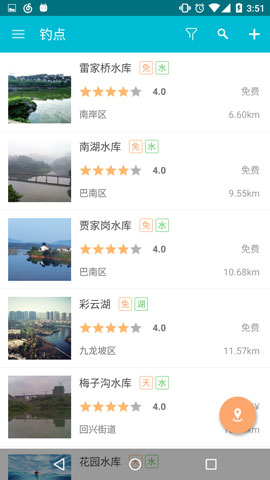

##FitSystemWindowLayout
自动适应StatusBar与NavigationBar的Layout。  
原理：根据你的配置自动设置基于StatusBar与NavigationBar的padding。 
方便的建立类似这样的APP

##使用
依赖 `compile 'com.jude:fitsystemwindowlayout:1.0.8'`  

在value-v21包中的styles.xml中设置

        <item name="android:windowTranslucentStatus">true</item>
        <item name="android:windowTranslucentNavigation">true</item>
        <item name="android:windowDrawsSystemBarBackgrounds">true</item>

在根布局看需求使用  
`FitSystemWindowsLinearLayout`  
`FitSystemWindowsFrameLayout`  
`FitSystemWindowsRelativeLayout`  
就像：

    <com.jude.fitsystemwindowlayout.FitSystemWindowsLinearLayout
        xmlns:android="http://schemas.android.com/apk/res/android"
        android:orientation="vertical"
        android:layout_width="match_parent"
        android:layout_height="match_parent"
        android:fitsSystemWindows="true"
        android:background="@color/white">
    
        <include layout="@layout/include_toolbar"/>
        <FrameLayout
            android:layout_width="match_parent"
            android:layout_height="match_parent">
        </FrameLayout>
        
    </com.jude.fitsystemwindowlayout.FitSystemWindowsLinearLayout>
    
最好加上`android:fitsSystemWindows="true"`虽然你加不加显示效果上没有任何区别，但你不加会导致`windowSoftInputMode`设置失效。  
可以使用

    app:padding_status="false"//默认为true
    app:padding_navigation="true"//默认为false
    app:status_color="#567890"//默认为colorPrimary
    
##注意
对本Layout设置的padding会无效。
使用NavigationBar时注意，触摸控件的位置。以及ListView/RecyclerView的内padding。
    
    